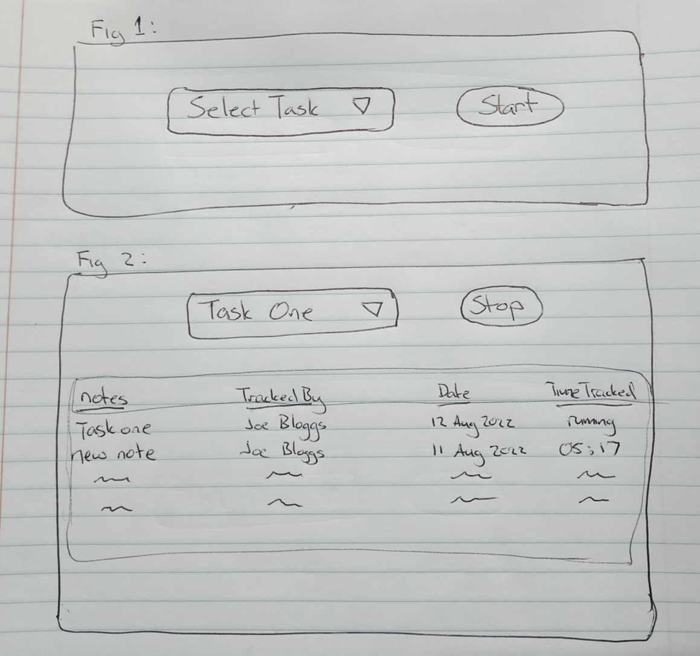

# Project Brief Overview

Create a simple time tracking application using react JS and ProWorkflow's GraphQL API endpoint. The application will present the user with the ability to

- 1) Select a task (select box)

- 2) Click a button to start and stop the timer.

- 3) Display the details of time record entries against a task.


# Project Brief Detailed Instructions

## Select Task
- Allow the user to select a task they wish to track time against from the GET_TASKS graphql query results.
- Once a task has been selected, the user should be presented with a “Start Timer Button” and display any "Time Record Entries".

## Start Timer (Button)
-	The user should be presented with a button to “Start Timer”, this will fire the START_TIMERECORD mutation.  
- Once a timer has been started, the User should be presented with a Stop Timer button and hide the Start Timer Button
- The user should not be able to select a different Task when a timer is started/running.

## Stop Timer (Button)
-	The stop timer button will fire the STOP_TIMERECORD mutation. 
-	An option to add ‘notes’ should be given when the user clicks ‘stop timer’ button and can be supplied to the STOP_TIMERECORD mutation
-	If no notes are added, the app should supply the task name and start date as notes to the mutation.

## Time Record Entries:
-	Below the Select Task and Start/Stop timer buttons, a tabular display of time records entries that have been tracked against the task should be shown.
-   This data can be found in the GET_TASKS query.
-	The display should be updated once a new time record has been stopped with newest time entries at the top.
- Stop time and Time Tracked only apply for stopped timers (running:false)

### Timer Entry Details to Display
-   Notes
-	Start date
-   Tracked by (contact full name)
-	Time tracked (HH:mm for stopped timers, 'running' for active timers) 


---
# Before you Start

    Visit www.proworkflow.com and sign up for a free trial.  
     - For 'Company Name'  enter "Dev Test" + [your first name]
     - e.g. DEVTESTjonathan (https://app.proworkflow.com/DEVTESTjonathan/)
     - 
    
    IMPORTANT: Please ensure you follow 'DEVTEST' naming convention to ensure you are granted access to GraphQL Enpoint and identified as a developer applicant.
       
   > ---
   > ## "DEVTESTjonathan" is referred below as 'workspace' 
   > ---


## Access to GraphQL API Key
- Reach out to our support team via live chat on https://www.proworkflow.com or email at support@proworkflow.com
- Explain you are completing the development test and ask them to provide the API Key of the trial you have just created.

### GraphQL Endpoint for applicaiton development
The public graphql endpoint is https://graph.proworkflow.com/[workspace]

-	Add the header below to authenticate your post requests
```
{ "Authorization":"YOUR-API-KEY"}
``` 

### GraphQL Testing/Debuging Environment
-	Within your free trial there is a GraphQL playground environment. You can visually explore the schema or write test queries at https://app.proworkflow.com/[workspace]/explorer/  (EG: https://app.proworkflow.com/DEVTESTjonathan/explorer/)

- you can copy/paste queries from queries.gql in this 'explorer' to view the results, or write your own to learn GraphQL syntax
- the query below will return all active tasks (no filtering) with any timerecord entries nested inside
 ```
{
    tasks{
        id 
        name 
        timerecords{
            id 
            timespent
        }
    }
}  
```

---
# Additional Instructions 
- Please commit regularly with commit messages so we can understand your progress as the app develops
- You are welcome to make use of any component libraries such as Material UI
- A simple wireframe is found below to be used as a guide.
- You are free to make any changes or UX decisions to the wireframe if you wish which may aid in the usability of this time tracking application. 
- The graphql Query and Mutations are supplied in queries.gql file in this repo
- Code structure, Component Libraries, UX and Design decisions are likely to be discussion points during the interview so prepare for discussions about these choices.


Simple Wireframe

  

